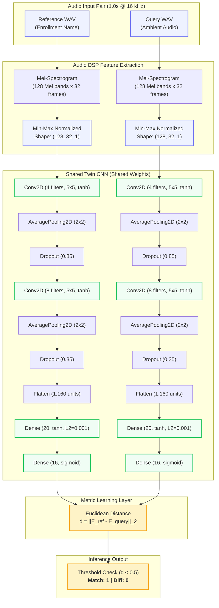
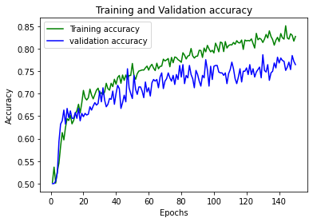
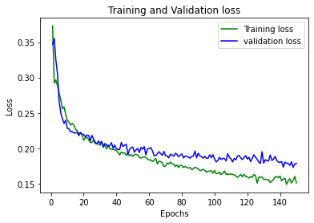

# Name Calling — On-Device Acoustic Name Detection

[](https://www.samsungprism.com/)
[](https://www.python.org/)
[](https://www.tensorflow.org/)
[](https://librosa.org/)
[](LICENSE)

> **Samsung R&D Institute Bangalore (SRIB) — PRISM Program**  
> Developed by **Team Congruent**: Swaraj Gupta, Shiv Jaiswal, Mayank Goyal.

---

## Acknowledgments & SRIB-PRISM Program

First of all, we would like to express our deepest gratitude to the whole **Samsung PRISM** team for providing us with this wonderful opportunity. This program provided us with hands-on industry research experience, demonstrating how theoretical machine learning and audio signal processing concepts translate into real-world consumer device solutions.

Dealing with raw audio representations and metric learning was an exciting new challenge for our team. Through close collaborative effort, systematic experimentation, and invaluable guidance from our Samsung mentor, we successfully completed all project milestones. We are deeply thankful to our mentor for continuous support, architectural insights, and guidance throughout the development lifecycle.

---

## Problem Statement

When listening to music or multimedia using headphones, users often miss someone calling their name due to passive noise isolation or high playback volume.

**The Challenge:** Build an intelligent, on-device mobile detection system that senses when the user's name is being spoken in their environment. Upon detection, the device can automatically duck media volume or trigger haptic feedback so the user can respond.

### The Zero-ASR Constraint

A core rule of the challenge was **Zero Automatic Speech Recognition (ASR)**:

- **No Speech-to-Text (STT) conversion** was permitted.
- Large pre-trained acoustic or language models (such as DeepSpeech, Kaldi, or Whisper) were strictly prohibited.
- **Why this constraint?**
  1. **Ultra-Low Latency:** Real-time on-device audio classification requires latency under 50 ms to react immediately to spoken cues.
  2. **Edge Power & Memory Efficiency:** Heavyweight speech recognition pipelines drain mobile battery and exceed wearable / edge DSP memory limits.
  3. **Privacy-by-Design:** Processing acoustic spectrogram embeddings directly means spoken audio is never transcribed into textual logs or transmitted to cloud servers.
  4. **Speaker-Agnostic Matching:** The model learns acoustic phonetic proximity between a reference enrollment sample and an ambient query snippet.

---

## Proposed Method

To solve the name-calling detection problem under the Zero-ASR constraint, we designed an acoustic metric learning pipeline based on a **Siamese Twin Convolutional Neural Network (CNN)**:

```
               +-------------------------------------------------+
               |       Raw 1-Second Audio (.wav, 16 kHz Mono)    |
               +-------------------------------------------------+
                                        |
                                        v
               +-------------------------------------------------+
               |          Audio DSP Feature Extraction           |
               |   STFT -> 128 Mel Bands -> Min-Max Norm [0, 1]  |
               +-------------------------------------------------+
                                        |
                     +------------------+------------------+
                     |                                     |
                     v                                     v
            [Reference Matrix]                      [Query Matrix]
              (128, 32, 1)                          (128, 32, 1)
                     |                                     |
                     v                                     v
         +-----------------------+             +-----------------------+
         | Base CNN (Weights W)  |             | Base CNN (Weights W)  |
         | Conv2D -> Pool -> Drop|             | Conv2D -> Pool -> Drop|
         | Dense(20) -> Dense(16)|             | Dense(20) -> Dense(16)|
         +-----------------------+             +-----------------------+
                     |                                     |
                     v                                     v
            [Embedding E_ref]                     [Embedding E_query]
                (16-D L2)                             (16-D L2)
                     \                                     /
                      \                                   /
                       v                                 v
               +-------------------------------------------------+
               |             Euclidean Distance Layer            |
               |           d = || E_ref - E_query ||_2           |
               +-------------------------------------------------+
                                        |
                                        v
               +-------------------------------------------------+
               |                Decision Threshold               |
               |    d < 0.5  =>  Match (1) [Name Called!]        |
               |    d >= 0.5 =>  Non-Match (0) [Ignore]          |
               +-------------------------------------------------+
```

### Pipeline Overview

1. **Audio Standardization:** Audio signals are sampled at $16\text{ kHz}$ mono. Inputs are trimmed or zero-padded to a fixed 1.0-second window ($16,000$ samples).
2. **Mel-Spectrogram Extraction:** We extract a 128-band Mel-frequency spectrogram via Short-Time Fourier Transform (STFT), capturing the fundamental acoustic and phonetic timbre of spoken names.
3. **Data Normalization:** Spectrogram power intensities are scaled between $[0, 1]$ via min-max normalization, producing 2D acoustic images of dimension $(128 \times 32 \times 1)$.
4. **Siamese Twin CNN:** A lightweight feature-extractor subnetwork maps the 2D Mel-spectrogram into a dense 16-dimensional embedding space.
5. **Contrastive Metric Learning:** The network is trained on positive pairs (same name) and negative pairs (different names) using **Contrastive Loss** with a margin of $1.0$.
6. **Euclidean Distance Classification:** At inference, the Euclidean distance $d$ between the reference embedding and query embedding is measured:
   $$\text{Prediction} = \begin{cases} 1 \quad (\text{Match / Name Called}) & \text{if } d < 0.5 \\ 0 \quad (\text{Non-Match / Distractor}) & \text{if } d \ge 0.5 \end{cases}$$

---

## Dataset

### Dataset Specifications

The complete dataset contains **1,260 audio WAV recordings** divided into training and testing partitions:

- **`train_wav/`**: $1,000$ audio files across 20 distinct name classes ($50$ recordings per name variation).
- **`test_wav/`**: $260$ audio files across 20 distinct name classes ($13$ recordings per name variation).

### 20 Name Classes

The dataset encompasses 20 phonetically diverse name variations recorded across multiple speakers and environments:

```
abhishek    anmol       anurag      deewanshu   himanshu
kishan      mayank      narender    neeraj      prince
ritvik      sayan       shiv        shreyas     shubham
siddharth   sourav      swaraj      utkarsh     vikrant
```

### Collection & Recording Strategy

1. **Recording Protocol:** Audio samples were recorded using mobile smartphone microphones across varied room acoustics and ambient noise levels.
2. **Duration & Format:** Each audio file captures a single isolated name utterance with an average duration of $\le 1.0\text{ second}$, exported in uncompressed 16-bit PCM WAV format.
3. **File Naming Convention:** Structured as `<name><3-digit-id>.wav` (e.g., `abhishek001.wav`, `swaraj012.wav`, `mayank076.wav`).
4. **Pair Generation:** From the base samples, pairs are dynamically created for Siamese training:
   - **Positive Pairs $(A_1, A_2, 1)$:** Two distinct utterances of the *same* name.
   - **Negative Pairs $(A_1, B_1, 0)$:** Utterances of two *different* names.

---

## Model Architecture

### Siamese Twin Network Diagram



### Base CNN Layer Specification

The base subnetwork was deliberately engineered to be ultra-compact (only **24,468 total parameters**) to enable instant mobile edge execution:

| Layer | Type | Output Shape | Activation | Regularization | Param # |
| :--- | :--- | :--- | :--- | :--- | :--- |
| `input` | InputLayer | `(None, 128, 32, 1)` | — | — | 0 |
| `conv2d_1` | Conv2D | `(None, 124, 28, 4)` | `tanh` | Kernel: `(5, 5)` | 104 |
| `avg_pool_1` | AveragePooling2D | `(None, 62, 14, 4)` | — | Pool: `(2, 2)` | 0 |
| `dropout_1` | Dropout | `(None, 62, 14, 4)` | — | Rate: `0.85` | 0 |
| `conv2d_2` | Conv2D | `(None, 58, 10, 8)` | `tanh` | Kernel: `(5, 5)` | 808 |
| `avg_pool_2` | AveragePooling2D | `(None, 29, 5, 8)` | — | Pool: `(2, 2)` | 0 |
| `dropout_2` | Dropout | `(None, 29, 5, 8)` | — | Rate: `0.35` | 0 |
| `flatten` | Flatten | `(None, 1160)` | — | — | 0 |
| `dense_1` | Dense | `(None, 20)` | `tanh` | L2 Penalty (`0.001`) | 23,220 |
| `dense_2` | Dense (Embedding) | `(None, 16)` | `sigmoid` | — | 336 |

- **Total Parameters:** 24,468 (95.5 KB)
- **Trainable Parameters:** 24,468
- **Non-trainable Parameters:** 0

### Loss Function: Contrastive Loss

The Siamese network optimizes the **Contrastive Loss** function defined as:
$$\mathcal{L}(Y, d) = \frac{1}{2} Y d^2 + \frac{1}{2} (1 - Y) \max(0, m - d)^2$$
Where:

- $Y = 1$ for positive pairs (same name) and $Y = 0$ for negative pairs (different names).
- $d = \|\mathbf{x}_1 - \mathbf{x}_2\|_2$ is the Euclidean distance between embedding vectors.
- $m = 1.0$ is the contrastive margin enforcing separation between distinct names.

---

## Training Dynamics & Performance

The model was trained for 150 epochs using the Adam optimizer with a batch size of 32 on the positive/negative pair dataset.

### Training & Validation Curves

<p align="center">
  
  
</p>

### Final Evaluation Metrics

Evaluated on the held-out validation pairs:

| Evaluation Metric | Training Set | Validation Set |
| :--- | :---: | :---: |
| **Classification Accuracy** | **89.50%** | **76.54%** |
| **ROC-AUC Score** | **0.8950** | **0.7654** |
| **Matthews Correlation Coefficient (MCC)** | **0.7924** | **0.5310** |
| **F1-Score** | **0.8989** | **0.7617** |

> *Note on Overfitting:* As noted in our original project submission, minor overfitting occurs due to the constrained hackathon dataset size (1,260 raw clips). Data augmentation (spec-augment, pitch-shifting, background noise injection) can further enhance out-of-domain generalization.

---

## Repository Structure

```
Name-Calling-SAMSUNG/
├── Congruent.apk                       # Compiled Android APK demo (SDK >= 26)
├── Dataset/                            # Audio dataset archives (WAV format)
│   ├── train_wav_1.rar                 # Partition 1 of training audio (500 files)
│   ├── train_wav_2.rar                 # Partition 2 of training audio (500 files)
│   └── test_wav.rar                    # Validation audio dataset (260 files)
├── Script_test (for testing golden dataset)/
│   ├── test_golden_dataset.py          # Refactored CLI evaluation script
│   ├── Test_golden_dataset.ipynb       # Evaluation notebook (Google Colab)
│   ├── textinput.txt                   # Sample test pairs: <serial_no> <ref_path> <query_path>
│   └── txtoutput.txt                   # Golden prediction outputs (<serial_no> \t <pred>)
├── Script_training_validation/
│   ├── Training_validation.py          # Feature extraction & Siamese training script
│   └── Training_validation.ipynb       # Colab training notebook with cell outputs
├── model/                              # Trained TensorFlow / Keras SavedModel
│   ├── saved_model.pb                  # SavedModel protobuf graph definition
│   ├── keras_metadata.pb               # Keras metadata definitions
│   └── variables/                      # Trained model weights checkpoint
├── assets/                             # Architecture diagrams & training plots
│   ├── accuracy_vs_epochs.png          # High-resolution training accuracy curve
│   └── loss_vs_epochs.png              # High-resolution training loss curve
├── .gitignore                          # Clean repository hygiene
├── LICENSE                             # MIT License
└── README.md                           # Project documentation
```

---

## Getting Started & Usage

### 1. Environment Setup

Install the necessary audio signal processing and machine learning dependencies:

```bash
pip install tensorflow librosa numpy scikit-learn opencv-python matplotlib
```

### 2. Testing Your Golden Dataset

The evaluation script accepts an input text file specifying audio pairs and generates predictions (`1` for match, `0` for distractor):

```bash
cd "Script_test (for testing golden dataset)"
python test_golden_dataset.py --model ../model --input textinput.txt --output txtoutput.txt
```

**CLI Arguments:**

- `--model`: Path to the trained SavedModel directory (defaults to `../model`).
- `--input`: Path to the input test pairs file (defaults to `textinput.txt`).
- `--output`: Path where predictions should be saved (defaults to `txtoutput.txt`).
- `--threshold`: Euclidean distance cutoff for a match (default: `0.5`).

**Format of `textinput.txt`:**

```
#1    /path/to/abhishek011.wav    /path/to/abhishek012.wav
#2    /path/to/anurag011.wav      /path/to/shiv008.wav
```

**Format of `txtoutput.txt`:**

```
#1    1
#2    0
```

### 3. Model Training & Validation

To train the Siamese model from scratch:

1. Extract the RAR archives in `Dataset/`:

   ```bash
   # Extract train_wav_1.rar and train_wav_2.rar into Dataset/train_wav/
   # Extract test_wav.rar into Dataset/test_wav/
   ```

2. Run the training script:

   ```bash
   cd Script_training_validation
   python Training_validation.py
   ```

3. Alternatively, open and execute `Training_validation.ipynb` directly in Google Colab (GPU accelerated).

---

## Android Application Demo

An Android application named **Congruent.apk** is included in the root directory:

- **Minimum Requirement:** Android Oreo (API level 26) or higher.
- **Workflow:**
  1. Record a 1.0-second **Reference Audio** (the enrolled name).
  2. The navigation view updates automatically to prompt for the **Query Audio**.
  3. Tap **Record** to capture 1.0 second of ambient audio.
  4. Use **Recorder List** to listen to recorded clips and verify clarity.
  5. Tap **Reset** to re-record in case of background noise or error.

> *Note:* The bundled APK demonstrates audio capture and audio management UI; the on-device TFLite inference integration was scoped for subsequent development.

---

## Meet Team Congruent

Developed under the **Samsung PRISM Program** at **Samsung R&D Institute India - Bangalore (SRIB)**:

| Team Member | Contact |
| :--- | :--- |
| **Swaraj Gupta** | [swaraj.gupta217@gmail.com](mailto:swaraj.gupta217@gmail.com) |
| **Shiv Jaiswal** | [shivjaiswal2000@gmail.com](mailto:shivjaiswal2000@gmail.com) |
| **Mayank Goyal** | [goyalmayank522@gmail.com](mailto:goyalmayank522@gmail.com) |

If you have any questions, feedback, or suggestions regarding this project, please feel free to reach out to any member of the team!
